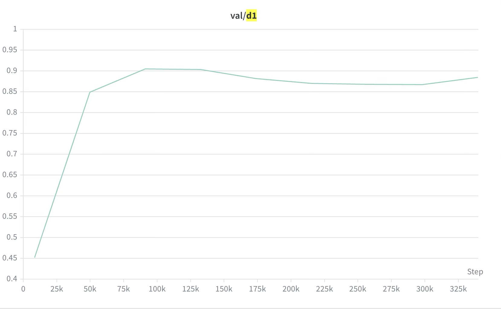
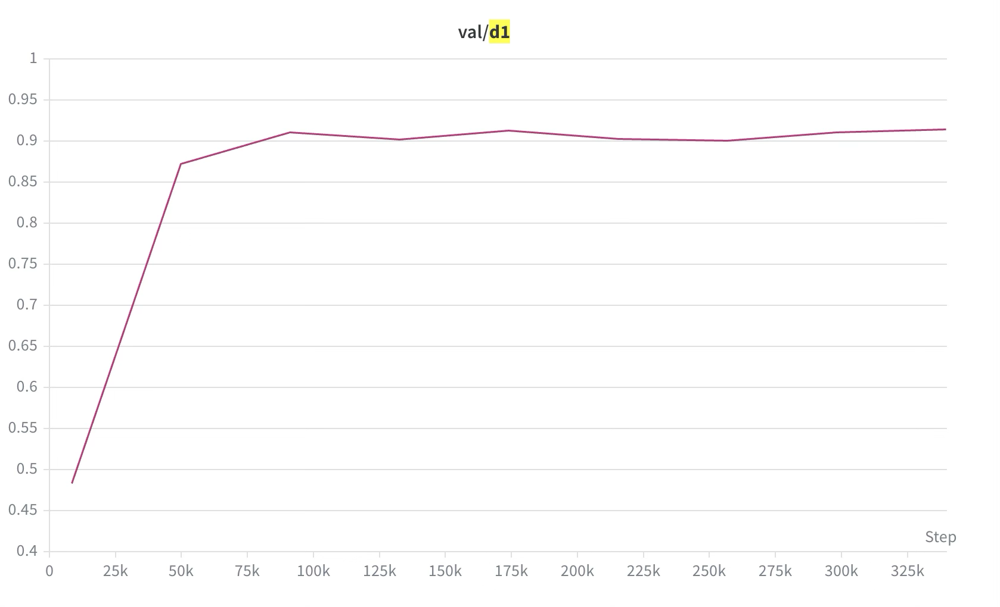

## Training 

### Hardware
We use 4x48GB GPUs for training. The batch size ("bs=2") in the config file is **per GPU**, so the equivalent batch size is 8.

### Dataset Preparation
You need to download the 2 datasets (Hypersim + TartanAir) we used for training and the ZEDD dataset for validation. Here is how:

#### Hypersim
We use the OMNI-DC data preparation.
Follow the [official link](https://github.com/apple/ml-hypersim). To save some disk space, note you only need two modalities: the tonemapped jpg files
and the depth hdf5 file. Also clone their [Github repo](https://github.com/apple/ml-hypersim), which contains useful metadata. The final structure looks like this:

```
hypersim
  ├──dataset
  │   ├──ai_001_001
  │   │   └──images
  │  ...        ├──scene_cam_00_final_preview
  │             │   └── frame.0000.tonemap.jpg
  │             └──scene_cam_00_geometry_hdf5
  │                 └── frame.0000.depth_meters.hdf5
  └──ml-hypersim            
```

Finally, place the hypersim dataset under "dataset/datasets"


#### TartanAir
We use the OMNI-DC data preparation.
Follow the instructions [here](https://theairlab.org/tartanair-dataset/). 

```
tartanair
  ├──abandonedfactory
  │   ├──Easy
  │   └──Hard
 ...
  └──westerndesert
      ├──Easy
      └──Hard
```
Finally, place the TartanAir dataset under "dataset/datasets"


#### Finetuning on DDFF-12
If you follow the instructions in the main README.md, you should already have "ddff12_val_generation" under "dataset/datasets".

### Running Training Experiments and Expected Results

---

## fossa-vits

Download the **Depth-Anything-V2-Small (Hypersim)** checkpoint:  
https://github.com/DepthAnything/Depth-Anything-V2/tree/main/metric_depth  

Place it at:
FOSSAModel/checkpoints/depth_anything_v2_metric_hypersim_vits.pth

### Run training
```bash
bash dist_train.sh \
  --encoder=vits \
  --bs=2 \
  --pretrained_or_resumed=pretrained \
  --pretrained_from=FOSSAModel/checkpoints/depth_anything_v2_metric_hypersim_vits.pth \
  --train_dataset Hypersim+TartanAir \
  --val_loader_config_choice zedd_F2_8_fixed_fd_0_2_4_6_8 \
  --augment \
  --train_random_scaling \
  --train_power_inverse_sampling
```

- Evaluates on ZEDD every 5 epochs  
- Logs results to Weights & Biases (wandb)

### Expected validation behavior
The D1 curve from validating on ZEDD during training should resemble:
<p align="center">
  
</p>


---

## fossa-vits-ddff-finetuned

### Run training
```bash
bash dist_train.sh \
  --encoder=vits \
  --bs=2 \
  --pretrained_or_resumed=resumed \
  --resumed_from=fossa-vits \
  --train_dataset ddff12_train \
  --val_loader_config_choice ddff12_val \
  --augment \
```

- Best performance occurs after ~1 epoch (~66k samples)  
- Use checkpoint: 0.pth

### Expected results

| MSE | RMSE | AbsRel | SqRel | D1 | D2 | D3 |
|------:|------:|------:|--------:|------:|------:|--------:|
| 0.0004 | 0.0183 | 0.1076 | 0.0045|0.9363 | 0.9829 | 0.9908 |

---

## fossa-vitb

Download the **Depth-Anything-V2-Base (Hypersim)** checkpoint:  
https://github.com/DepthAnything/Depth-Anything-V2/tree/main/metric_depth  

Place it at:
FOSSAModel/checkpoints/depth_anything_v2_metric_hypersim_vitb.pth

### Run training
```bash
bash dist_train.sh \
  --encoder=vitb \
  --bs=2 \
  --pretrained_or_resumed=pretrained \
  --pretrained_from=FOSSAModel/checkpoints/depth_anything_v2_metric_hypersim_vitb.pth \
  --train_dataset Hypersim+TartanAir \
  --val_loader_config_choice zedd_F2_8_fixed_fd_0_2_4_6_8 \
  --augment \
  --train_random_scaling \
  --train_power_inverse_sampling
```

- Evaluates on ZEDD every 5 epochs  
- Logs results to wandb

### Expected validation behavior
The D1 curve from validating on ZEDD during training should resemble:
<p align="center">
  
</p>

---

## fossa-vitb-ddff-finetuned

### Run training
```bash
bash dist_train.sh \
  --encoder=vitb \
  --bs=2 \
  --pretrained_or_resumed=resumed \
  --resumed_from=fossa-vitb \
  --train_dataset ddff12_train \
  --val_loader_config_choice ddff12_val \
  --augment \
```

- Best performance occurs after ~1 epoch (~66k samples)  
- Use checkpoint: 0.pth

### Expected results

| MSE | RMSE | AbsRel | SqRel | D1 | D2 | D3 |
|------:|------:|------:|--------:|------:|------:|--------:|
| 0.0003| 0.0148 | 0.1088 | 0.0025 | 0.9322 | 0.9866 | 0.9939 |
